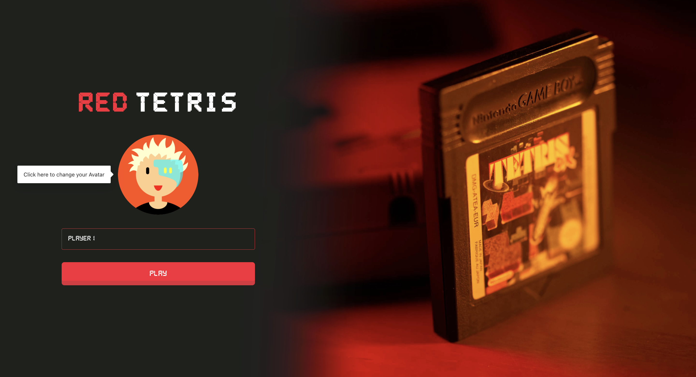
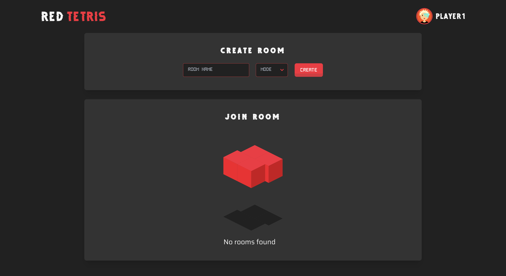
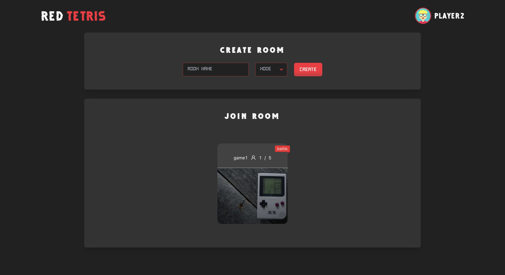
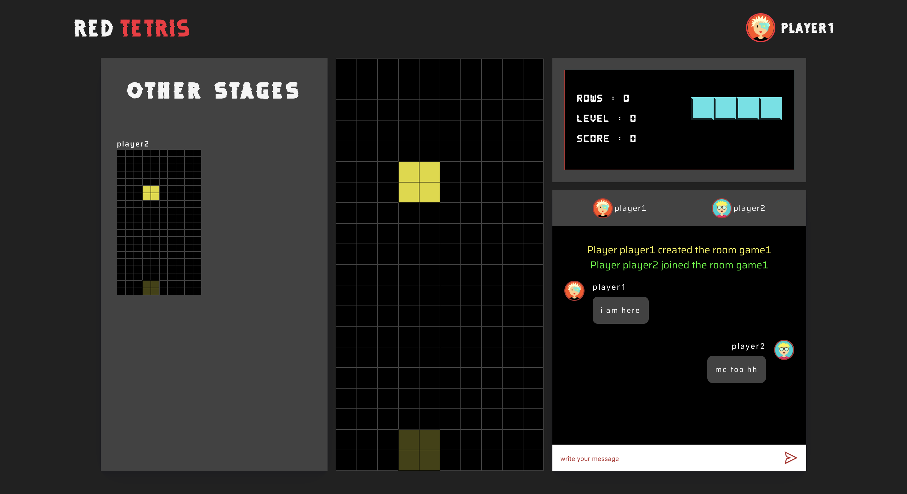
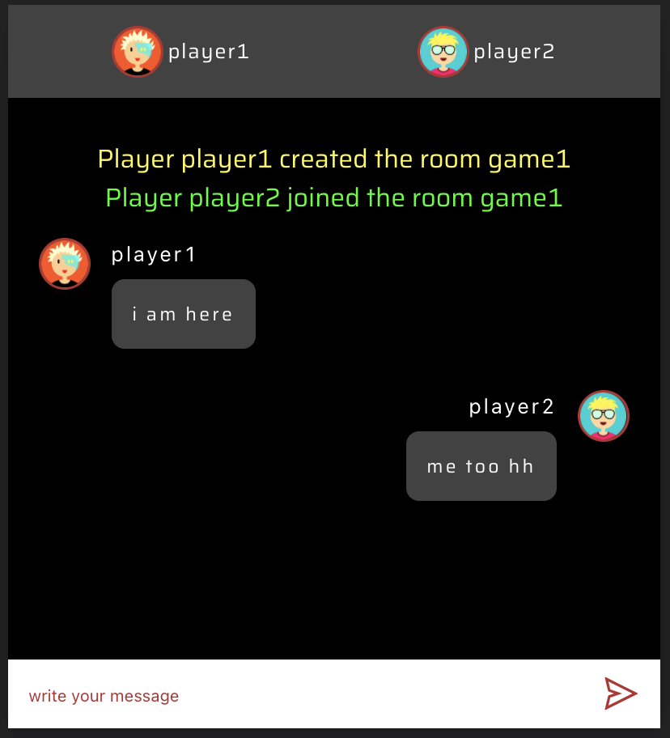
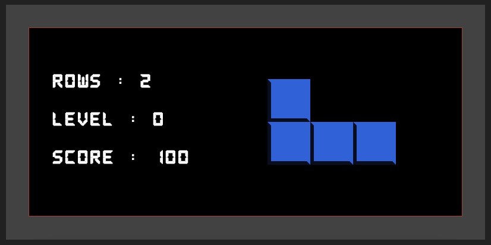
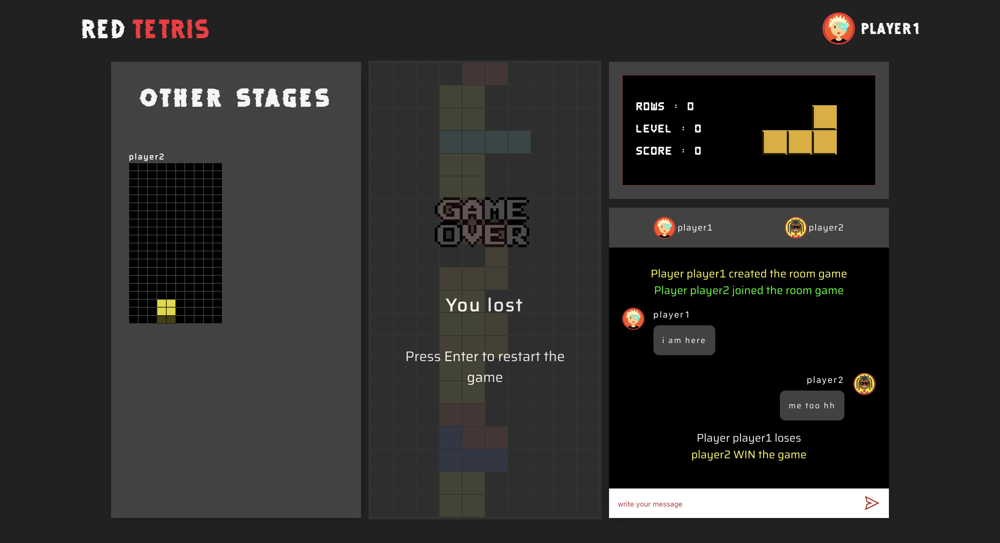
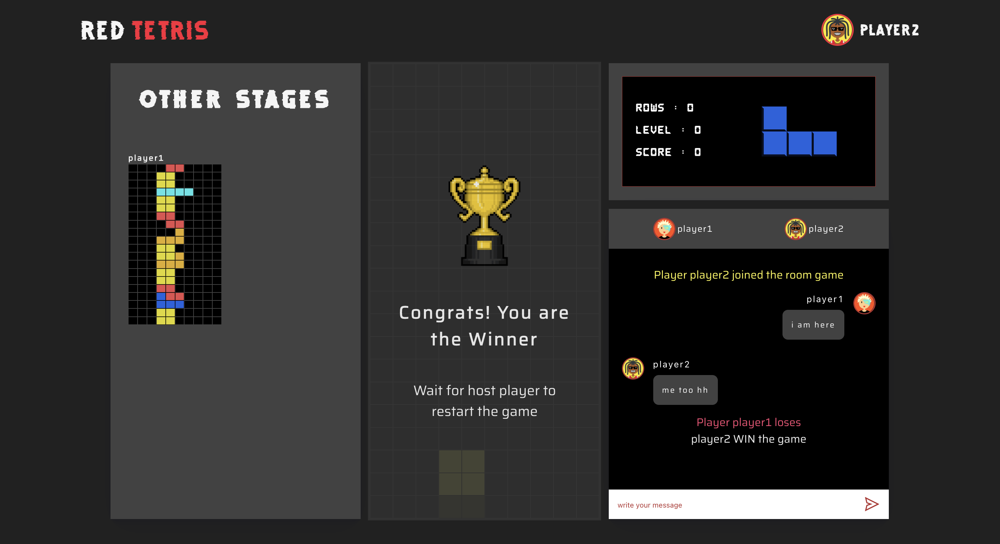

# 42-RedTetris

The objective of this project is to develop a networked multiplayer tetris game from a stack of software exclusively Full Stack Javascript

There also is a classic solo mode with a leaderboard.

Everything is in real time thanks to socket.io.

The code is entirely unit tested with jest.
<!-- 
You can try it out **[here](https://tetris-orange.herokuapp.com/#)**.
It can take some time to load the app, heroku servers must wake up. -->

## Built with

### Front-end

* React.js + Redux

### Back-end

* Node.js
* Socket.io

## Skills

* Object-oriented programming 
* Web 
* Functional programming 
* Technology integration 

## Usage
  After Cloned the repo you must install the packages with the command:
  ```
  npm i

  ```
  Then you can run the server && client with the command:
  ```
  npm run dev
  ```
  
  The server is running on port 1337.
  The client is running on port 3000. (http://localhost:3000/)

## TEST
To see the test coverage, run:
```
npm run test:coverage
```

## Project preview

### Home page


### Lobby



### game launched




### chat & score infos



### Game Over screen


### Winner screen

